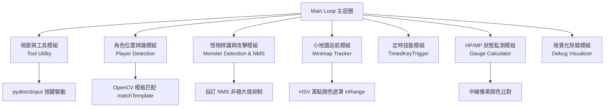
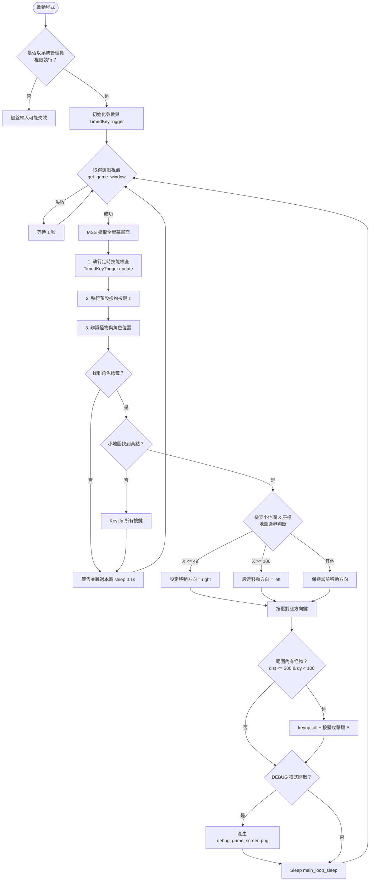

# 新楓之谷 (MapleStory) 自動化輔助程式

本專案是一個基於 Python 開發的《新楓之谷》自動化輔助腳本。利用 **OpenCV** 影像識別、**MSS** 高速螢幕擷取以及 **pydirectinput** 模擬底層 DirectInput 按鍵輸入，實現角色自動跑圖、怪物偵測攻擊、定時技能施放與小地圖邊界判斷。

---

## 🛠️ 主要功能模組

1. **視窗與工具模組 (Window & Tool Utility)**
   - 自動尋找並將《新楓之谷》遊戲視窗置頂與啟用 (`activate_window`, `get_game_window`)。
   - 提供按鍵狀態重置功能 (`keyup_all`)。

2. **角色位置辨識模組 (Player Location Module)**
   - 透過角色頭頂/腳下的名字標籤或勛章模板圖片 (`player_tag.png`) 進行 OpenCV 模板匹配 (`find_player_by_tag`)，精準定位角色於遊戲畫面中的 $(x, y)$ 座標。

3. **怪物辨識與攻擊模組 (Monster Detection & Attack Module)**
   - 支援多種怪物模板圖片比對，自動涵蓋**左轉與右轉 (水平翻轉)** 兩種姿態。
   - 引入 **非極大值抑制 (NMS - Non-Maximum Suppression)** 演算法過濾重疊的偵測框，確保怪物座標的準確性。
   - 自動計算角色與怪物的歐式距離與垂直高低差，於攻擊範圍內觸發攻擊按鍵。

4. **小地圖巡航與跑圖模組 (Minimap & Patrol Module)**
   - 擷取小地圖 ROI，利用 **HSV 色彩空間** 篩選出代表玩家位置的黃點 (`RGB(255, 255, 136)`)。
   - 設有地圖邊界檢測機制（例如 $X \le 49$ 向右折返，$X \ge 100$ 向左折返），實現地圖內的自動來回巡航。

5. **定時技能模組 (Timed Skill Trigger)**
   - 採用物件導向設計 (`TimedKeyTrigger`)，可獨立設定特定技能（如魔心防禦）的冷卻時間與自動觸發間隔。

6. **HP / MP 狀態監測模組 (Status Gauge Module)**
   - 可對遊戲下方血條與魔力條區域進行 RGBA 色彩百分比計算，自動判斷狀態並觸發補血或休息（目前可於主迴圈開啟/關閉）。

7. **視覺化除錯模組 (Debug Visualizer)**
   - `save_full_debug_image` 函式可繪製全螢幕的偵測標記，包括 HP/MP 框、小地圖 ROI、玩家中心點、攻擊警戒半徑及怪物定位點，並輸出為 `debug_game_screen.png` 供調校使用。

---

## 📊 系統架構與程式流程圖

### 1. 模組架構關聯圖 (Module Architecture)



---

### 2. 主迴圈執行流程圖 (Main Loop Flowchart)



---

## ⚙️ 環境建置與安裝

### 1. 必要 Python 套件

請先確保安裝 Python 3.8+，並執行以下指令安裝依賴套件：

```bash
pip install numpy opencv-python mss pygetwindow pydirectinput pillow
```

### 2. 目錄結構需求

執行前請於專案目錄下建立 `image/` 資料夾，並放入相對應的比對模板圖片：

```text
.
├── main.py                   # 主程式腳本
├── README.md                 # 專案說明文件
└── image/
    ├── player_tag.png        # 角色名字標籤 / 勛章模板
    ├── mo_00065.png          # 怪物 1 辨識模板
    └── mo_00059.png          # 怪物 2 辨識模板
```

---

## 🚀 使用說明與注意事項

1. **系統管理員權限 (關鍵)**：
   - 由於 `pydirectinput` 需要驅動遊戲底層的 DirectInput 介面，**必須以系統管理員權限**開啟 命令提示字元 (CMD)、PowerShell 或 IDE (如 VS Code / PyCharm) 執行該程式，否則遊戲內無法收到按鍵訊號。

2. **座標與解析度微調**：
   - **HP/MP 條與小地圖位置**：每個人的螢幕解析度或遊戲 UI 設定可能有所差異。若欲開啟 HP/MP 監測或小地圖黃點偵測，建議先將 `DEBUG = 1` 執行一次，檢視產生的 `debug_game_screen.png` 確保框選區域準確。
   - **地圖巡航邊界**：請根據當前掛機地圖的小地圖邊界，調整 `abs_mm_x <= 49` 與 `abs_mm_x >= 100` 之數值。