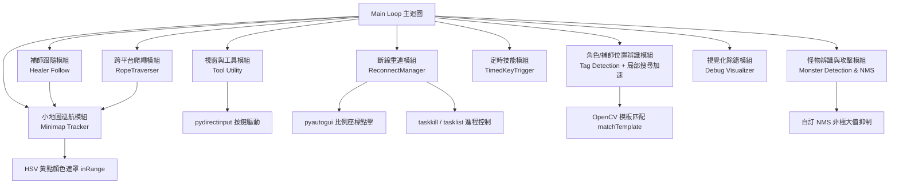
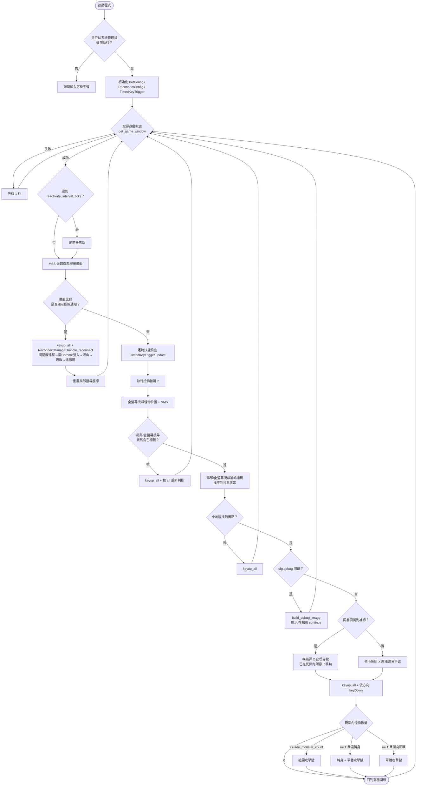

# 新楓之谷 (MapleStory) 自動化輔助程式

本專案是一個基於 Python 開發的《新楓之谷》自動化輔助腳本。利用 **OpenCV** 影像識別、**MSS** 高速螢幕擷取以及 **pydirectinput** 模擬底層 DirectInput 按鍵輸入，實現角色自動跑圖、怪物偵測攻擊、補師跟隨、定時技能施放、小地圖邊界判斷，並在偵測到斷線時自動執行重新登入流程。

---

## 🛠️ 主要功能模組

1. **視窗與工具模組 (Window & Tool Utility)**
   - 通用視窗尋找函式 (`get_window`)，支援標題精準匹配與模糊匹配（例如 Chrome 分頁標題會變動）。
   - 自動尋找並將《新楓之谷》遊戲視窗置頂與啟用 (`activate_window`, `get_game_window`)。
   - 提供按鍵狀態重置功能 (`keyup_all`)。
   - 效能優化：主迴圈每個 tick 只更新視窗座標，僅每隔 `reactivate_interval_ticks` 個 tick 才重新搶一次前景焦點，降低 `SetForegroundWindow` 呼叫開銷。

2. **角色 / 補師位置辨識模組 (Tag Detection Module)**
   - 通用標籤比對函式 (`find_player_by_tag`)，透過名字標籤或勛章模板圖片進行 OpenCV 模板匹配，可重複用來定位角色本人或補師 (`healer_tag.png`)。
   - 局部搜尋加速 (`locate_tag_with_fallback`)：優先在「上次偵測到的位置」附近的小範圍 ROI 搜尋，找不到才退回全螢幕搜尋重新定位，大幅降低 `matchTemplate` 運算量。
   - 模板圖片會快取於記憶體 (`_TAG_TEMPLATE_CACHE` / `_MONSTER_TEMPLATE_CACHE`)，避免每個 tick 重複讀檔解碼。

3. **怪物辨識與攻擊模組 (Monster Detection & Attack Module)**
   - 支援多種怪物模板圖片比對（`BotConfig.template_paths`），自動涵蓋**左轉與右轉 (水平翻轉)** 兩種姿態。
   - 引入**非極大值抑制 (NMS)** 演算法過濾重疊的偵測框，確保怪物座標的準確性。
   - 依範圍內怪物數量自動切換攻擊方式：達到 `aoe_monster_count` 隻以上觸發範圍攻擊 (`aoe_attack_key`)；只有 1 隻則轉身面向後使用單體攻擊 (`single_attack_key`)。

4. **小地圖巡航與跑圖模組 (Minimap & Patrol Module)**
   - 擷取小地圖 ROI，利用 **HSV 色彩空間** 篩選出代表玩家位置的黃點。
   - 依 `minimap_left_bound` / `minimap_right_bound` 設有地圖邊界檢測機制，實現地圖內的自動來回巡航；亦可依小地圖 Y 座標動態切換不同樓層的邊界值（多層地圖）。

5. **補師跟隨模組 (Healer Follow Module)**
   - 同時比對補師標籤位置，若判定與玩家在同一樓層（Y 座標差在 `healer_y_tolerance` 內），會改為朝補師 X 座標靠攏移動，進入 `healer_x_dead_zone` 死區後停止移動；找不到補師或不同層時則退回原本的邊界折返巡邏邏輯 (`decide_move_target`)。

6. **定時技能模組 (Timed Skill Trigger)**
   - 採用物件導向設計 (`TimedKeyTrigger`)，可獨立設定特定技能的冷卻時間與自動觸發間隔。

7. **斷線重連模組 (Reconnect Module)**
   - 透過模板比對持續偵測畫面是否出現斷線通知 (`is_disconnected`)。
   - 偵測到斷線後自動：強制關閉舊的遊戲進程 (`force_close_game`) → 開啟/喚醒 Chrome 並依比例座標點擊登入官網、gamapass 登入、選擇角色 → 等待伺服器選擇畫面出現 → 選伺服器、選頻道、進入遊戲。
   - 具備重試機制（`max_reconnect_attempts` 輪、每輪間隔 `retry_backoff_seconds` 秒），連續失敗達門檻會自動停止腳本以避免無限重試，並提示需要人工介入。
   - 所有點擊座標皆以「目標視窗寬高比例」而非桌面絕對座標計算，換解析度時較不易失準；開啟 `debug_click_screenshots` 可在每次點擊前存一張標記十字準心的截圖，方便校正比例。

8. **HP / MP 狀態監測模組 (Status Gauge Module)** — 目前主迴圈未啟用（程式碼保留供未來開啟）
   - 可對遊戲下方血條與魔力條區域進行 RGBA 色彩百分比計算，自動判斷狀態並觸發補血或休息 (`read_hp_mp`, `handle_hp_mp`)。

9. **視覺化除錯模組 (Debug Visualizer)**
   - `build_debug_image` 會繪製全畫面的偵測標記，包括 HP/MP 框、小地圖 ROI 與玩家黃點、角色中心點與攻擊警戒半徑、補師同層判定帶與跟隨死區、每隻怪物的距離標註，以及下方 10. 的平台/繩索校正輔助線。
   - `cfg.debug = True` 時主迴圈會改走除錯分支（不執行實際移動/攻擊）；`debug_show_window` 可即時顯示監看視窗，`debug_save_image` 會輸出為 `debug_game_screen.png`。

10. **跨平台爬繩模組 (Rope Traverser)**
    - 由於主畫面座標會隨鏡頭捲動而改變，此模組改用小地圖上的色點（不受鏡頭影響）來判斷角色所在位置。但 `LayerConfig`/`RopeConfig` 存的座標**不是**小地圖裁切區域內部的相對值（0~150 / 0~100 那個範圍），而是 `get_minimap_player_abs_pos` 已經把小地圖在視窗內的偏移量加回去、換算出來的**遊戲視窗絕對像素座標**——跟 `debug_game_screen.png`（或任何一張完整遊戲視窗截圖）裡的像素座標是同一個座標系。校正時直接把截圖丟進圖片檢視器、點選小地圖上的色點讀出像素座標填入即可，不需要額外扣掉小地圖本身的位移量。
    - 用 `LayerConfig` 定義地圖有哪些平台：Y 座標範圍 + 該層專屬的左右巡邏邊界；用 `RopeConfig` 定義每條繩索的 X 座標，以及它連接的上/下層 index。兩者集中設定在 `BotConfig.layers` / `BotConfig.ropes`。
    - `RopeTraverser` 狀態機負責跨多個 tick 執行「左右對齊繩索 X 座標 (`align`) → 抓繩 (`grab`) → 按住 `climb_up_key` 往上爬 / 按住 `drop_down_key` 再點 `drop_jump_key` 直接掉落到下層 (`climb`)」，完成前主迴圈的一般巡邏與攻擊判斷會暫時讓位給它。往上爬完成的判斷用的是 `climbing_pose_template` 比對，連續 `climb_pose_lost_confirm_ticks` 次都偵測不到爬繩姿勢才視為爬完，而不是單看小地圖 Y 座標——小地圖太小，Y 範圍常常在角色實際到達平台前就先進入判定範圍，導致提前放開爬繩鍵卡在繩索中途；只有在沒有畫面可比對時才會退回用 Y 座標當備援判斷。
    - **抓繩動作優化**：對齊繩索 X 座標後，往上爬預設不會直接站著按 `climb_up_key`，而是先用「方向鍵 + 跳躍鍵 (`drop_jump_key`)」斜向跳起再按住爬繩鍵，比原地站著按爬繩鍵更容易真的咬到繩子；此行為由 `use_jump_to_grab_rope` 控制，容忍度、跳躍持續時間與重試次數分別對應 `grab_x_tolerance` / `grab_hold_seconds` / `grab_retry_interval` / `grab_max_retries`。
    - **爬繩姿勢範本確認**：新增 `is_player_climbing`，用一張「角色爬繩姿勢」範本圖 (`climbing_pose_template`，預設 `image/climbing_pose.png`) 在玩家座標附近比對，確認角色是否真的抓到繩子在爬，而不是單憑「已經按下爬繩鍵」就假設一定成功；`grab` 階段沒偵測到爬繩姿勢就會依 `grab_retry_interval` 自動重跳。
    - 主迴圈依目前所在平台計算該層的巡邏邊界，並在角色小地圖 X 座標接近某條繩索時（`rope_x_tolerance`）觸發爬繩/掉落，藉此讓角色依序走遍地圖上所有已設定的平台並持續打怪；`min_seconds_between_climbs` 避免剛完成動作又立刻折返、`post_transition_cooldown` 讓爬繩/掉落動畫播完再恢復巡邏判斷、`climb_timeout_seconds` 則是卡住時的逾時保護。
    - **同層巡邏次數門檻**：`PatrolLapTracker` 會計算角色在目前平台已經觸碰邊界折返幾次，未達到 `min_patrol_bounces_before_climb`（預設 3 次）之前，就算靠近繩索也不會觸發爬繩，避免角色一到繩索附近就馬上換平台、同一層打不到幾隻怪就走了；換到新平台或成功開始爬繩時計數會自動歸零重算。折返次數是以「觸碰邊界」為單位：左邊界走到右邊界算 1 次，一個完整來回(左→右→左)則是 2 次，想要「完整巡邏 3 趟」可以把這個值設成 6。
    - **其他玩家 / 隊友避讓**：確定要爬繩換層前，會用 `get_other_player_minimap_positions` / `get_teammate_minimap_positions` 比對小地圖上「其他玩家」(`#EE0000` 紅色) 與「隊友」(`#FF7700` 橘色) 的色點，透過 `find_occupied_layers` 換算成所在平台。若這次要移動過去的目標平台已經有其他玩家或隊友，就放棄這次換層、留在原地繼續巡邏，下次滿足巡邏次數門檻時會再重新判斷一次；此行為由 `cfg.detect_other_players` 開關控制。這兩種色點的 HSV 顏色範圍是遊戲固定顯示色，比照小地圖自己黃點 (`find_player_on_minimap`) 的作法直接寫死在對應函式內，不放進 `BotConfig`。
      - **排查誤判**：若懷疑判斷有誤（例如小地圖上的固定 UI 元素顏色跟 `#EE0000`/`#FF7700` 太接近），主迴圈只要偵測到任何色點就會印出 `[跨平台爬繩模組] 偵測到色點 - 其他玩家:[...] 隊友:[...]`，可以對照印出的座標判斷是真的有人還是誤判；也可以開 `cfg.debug = True` 並把 `build_debug_image` 的 `show_other_players` 打開（主迴圈已依 `cfg.detect_other_players` 自動帶入），偵測到的色點會用十字標記畫在 `debug_game_screen.png` 上並標註座標，方便直接對照畫面確認是不是固定 UI 元素被誤判。
    - 若 `cfg.layers` 保持空清單，此模組完全不介入，行為會退回原本單層 `minimap_left_bound` / `minimap_right_bound` 巡邏（向後相容既有設定）。
    - **需要額外準備的範本圖**：從一張角色正在爬繩的截圖中，裁出角色本體(建議不含名字標籤)存成 `image/climbing_pose.png`，比對門檻可依實際比對分數調整 `climbing_pose_threshold`。
    - **校正方式**：開啟 `cfg.debug = True` 並在 `cfg.layers` / `cfg.ropes` 填入初步猜測值，執行後查看 `debug_game_screen.png` 上小地圖 ROI 內以綠色框標出的平台 Y 範圍、以紅色直線標出的繩索 X 座標，對照小地圖實際的平台與繩索位置反覆微調座標即可。因為座標本來就是整張截圖的絕對像素座標，也可以不開 debug、直接用任何一張遊戲視窗截圖搭配圖片檢視器，點選小地圖上想要的位置讀出像素座標來填。

---

## 📊 系統架構與程式流程圖

### 1. 模組架構關聯圖 (Module Architecture)



---

### 2. 主迴圈執行流程圖 (Main Loop Flowchart)



---

## ⚙️ 環境建置與安裝

### 1. 必要 Python 套件

請先確保安裝 Python 3.8+，並執行以下指令安裝依賴套件：

```bash
pip install numpy opencv-python mss pygetwindow pydirectinput pyautogui pillow
```

### 2. 目錄結構需求

執行前請於專案目錄下建立 `image/` 資料夾，並放入相對應的比對模板圖片：

```text
.
├── main.py                          # 主程式腳本
├── README.md                        # 專案說明文件
└── image/
    ├── player_tag.png               # 角色名字標籤 / 勛章模板
    ├── healer_tag.png               # 補師名字標籤模板 (補師跟隨模組用)
    ├── disconnect_notice.png        # 斷線通知對話框特徵
    ├── chrome_header_feature.png    # 官網 Chrome 分頁特徵 (重連流程用)
    ├── server_select_feature.png    # 遊戲「伺服器選擇」畫面特徵
    ├── disconnect_character.png     # 斷線後選角畫面特徵
    └── mo_XXXXX.png / 怪物名稱.png   # 各種怪物辨識模板 (可依 BotConfig.template_paths 增減)
```

---

## 🚀 使用說明與注意事項

1. **系統管理員權限 (關鍵)**：
   - 由於 `pydirectinput` 需要驅動遊戲底層的 DirectInput 介面，**必須以系統管理員權限**開啟 命令提示字元 (CMD)、PowerShell 或 IDE (如 VS Code / PyCharm) 執行該程式，否則遊戲內無法收到按鍵訊號。

2. **座標與解析度微調**：
   - **HP/MP 條、小地圖與怪物攻擊範圍**：每個人的螢幕解析度或遊戲 UI 設定可能有所差異。建議先將 `BotConfig.debug = True` 執行一次，檢視產生的 `debug_game_screen.png`（或開啟 `debug_show_window` 即時查看）確保框選區域準確。
   - **地圖巡航邊界**：請根據當前掛機地圖的小地圖邊界，調整 `BotConfig.minimap_left_bound` 與 `minimap_right_bound`。
   - **多層地圖跨平台爬繩**：若地圖有多個平台需要靠繩索往返（見上方模組 10.），在 `BotConfig.layers` 填入每層的 Y 範圍與該層邊界、在 `BotConfig.ropes` 填入每條繩索的 X 座標與連接的平台 index；這些座標都是遊戲視窗的絕對像素座標（與截圖像素座標一致，不是小地圖裁切區域內部的相對值），可以開 `debug` 模式對照 `debug_game_screen.png` 上的校正輔助線微調，也可以直接用任何一張截圖搭配圖片檢視器讀取像素座標填入。
   - **補師跟隨**：需先準備補師的名字標籤模板圖並設定 `healer_tag_path`，並依實際狀況調整 `healer_y_tolerance`（同層判定容忍度）與 `healer_x_dead_zone`（停止跟隨死區）。

3. **斷線重連設定**：
   - `ReconnectConfig` 中的各項 `_ratio` 皆為「相對於 Chrome / 遊戲視窗寬高的比例座標」，並非桌面絕對座標，更換解析度或視窗大小時通常不需重新校正；若登入頁面改版或比例跑掉，可暫時開啟 `debug_click_screenshots = True`，每次點擊前都會存一張標記十字準心的截圖以利重新校正。
   - `reconnect_url`、`game_process_name`、`game_window_title` 等需依實際遊戲版本與捷徑設定調整。
   - 連續重連失敗達 `max_consecutive_reconnect_failures` 次後，主迴圈會自動停止並印出提示，避免程式無限重試，此時需人工檢查登入流程是否有變動。

4. **設定集中管理**：
   - 所有可調參數集中於 `BotConfig`（一般掛機行為）與 `ReconnectConfig`（斷線重連流程）兩個 dataclass 中，修改參數不需更動主要邏輯程式碼。
